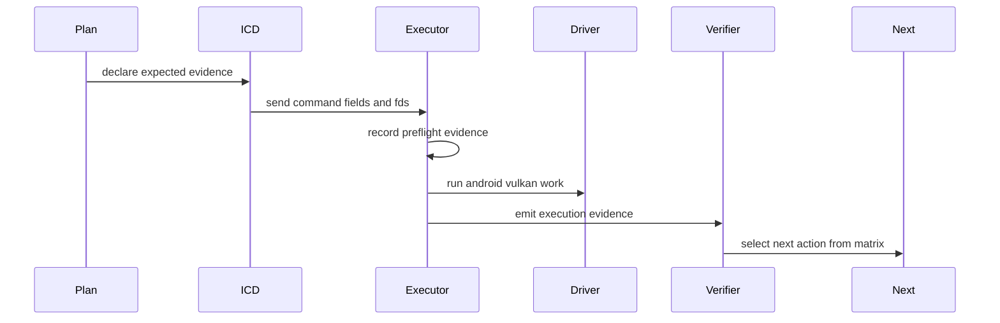

# Vulkan bridge probe matrix

Snapshot date: 2026-05-26.

The Vulkan bridge must be treated like a probe spacecraft: before a device run
starts, the run plan must already say what can go wrong, what evidence will be
needed, and which next action is allowed for each result.  This document is the
pre-flight matrix for llama.cpp GPU work and other Vulkan workloads.

The word "blocker" is intentionally avoided in the matrix.  Each row is a
potential failure mode, the required telemetry, and the decision rule.  A run
that cannot fill the required evidence is an instrumentation failure, not a
reason to guess.

## Probe phases

## Pre-flight evidence checklist

Every Q6 or benchmark-promoting run must have a planned output path and must
collect these fields before it is considered useful:

| Evidence group | Required fields |
|---|---|
| Build identity | APK version/build time, `executor_build_marker`, ICD marker, git commit |
| Workload identity | image/container id, model path/hash when available, prompt id, `ngl`, llama.cpp commit |
| API capture | command version, fd count, shader size, entry, dispatch dimensions, push size, specialization count |
| Object graph | descriptor set/binding, api offset/range, buffer size, memory offset/size, buffer id, memory id |
| SPIR-V | source hash, effective hash, local size, resolved local size, capabilities, descriptor access |
| Transform log | local-size patch result, specialization materialization report, safe-kernel flag, feature policy |
| Execution | upload/dispatch/download ms, pre/post barriers, fence result, Vulkan result code |
| Data integrity | before-upload hash, after-upload hash, after-dispatch hash, after-writeback hash |
| Correctness | prompt result, CPU oracle result when enabled, Q6 sample indices and deltas, Q6 final-store trace-v2 record when a debug probe is active, `q6_final_store_boundary` join evidence |
| Environment | host Vulkan driver/API version, memory pressure snapshot, swap/low-memory mode |

## Failure-mode matrix

| Phase | Possible problem | Required evidence | Decision rule |
|---|---|---|---|
| API capture | ICD dropped or reordered arguments | command version, field count, fd count, canonical field hash | Fix ICD serialization before touching executor math |
| API capture | Env/options not propagated | option source, manifest/env value, executor effective value | Fix propagation path; do not add one-off test-only flags |
| Object graph | Buffer id or memory id collapsed | per-binding ids, fd dev/ino, offset/range, strict object graph count | Fix handle table or V4 fields before shader changes |
| Object graph | Descriptor offset confused with memory offset | `api_offset`, `api_memory_offset`, descriptor write offset, backing fd offset | Fix coordinate conversion; do not tune kernels |
| Object graph | Alias handling changed app-visible layout | alias report, descriptor write report, binding object spans | Preserve app-visible descriptors; alias only transfer spans |
| SPIR-V identity | Wrong shader matched to Q6 path | source hash, source hash source, effective hash, probe source identity | Fix callsite identification; do not use hash-only guesses without source relation |
| SPIR-V transform | LocalSize and WorkgroupSize disagree | local size, resolved local size, materialization report | Legalize only scoped Q6 pattern; otherwise fail closed |
| SPIR-V transform | Specialization materialization skipped | `specialization_materialize_report.failure_reason`, folded counts, unsupported op | Add narrowly supported SPIR-V expression or leave driver specialization active with evidence |
| Pipeline creation | Android driver rejects module | Vulkan rc, feature mask, capability report, pipeline policy hash | Split feature enablement from shader mutation; record exact missing feature |
| Transfer | Input upload missed bytes | readable binding list, upload hash, skipped upload bytes | Fix descriptor-access reflection or transfer intent |
| Transfer | Output writeback missed bytes | writable binding list, writeback hash, dirty/writeback evidence | Fix writeback range and alias policy |
| Synchronization | GPU writes not visible to host | barrier count, fence result, invalidate path, device-local staging result | Fix barrier/fence/cache maintenance path |
| Shader execution | Native GPU result differs from CPU oracle | CPU oracle, Q6 sample indices, output sample hashes, SPIR-V final-store map, final-store trace-v2 metadata | Analyze shader semantics and driver-facing layout before performance work |
| Shader execution | Final-store trace differs from CPU oracle and writeback preserves the same value | `q6_final_store_boundary.summary`, final-store value, expected value, post-writeback value | Classify as native final-store/device execution; do not change executor writeback first |
| Transfer | Final-store trace matches CPU oracle but post-writeback differs | `q6_final_store_boundary.summary`, writable binding range, post-dispatch/writeback hashes | Fix executor writeback/range synchronization before judging shader arithmetic |
| Correctness | Prompt result wrong despite oracle pass | prompt response, token log, all dispatch classifications | Expand oracle coverage to the later wrong dispatch family |
| Performance | Correct output but slow | upload/dispatch/download split, cache hit stats, buffer residency | Tune only after correctness gate passes |
| Resource pressure | Run killed or partial logs | memory snapshot, last event id, journal path, command lifecycle marker | Add resumable evidence and early ENOMEM; do not infer compute result |

## Q6-specific expected branches

The next Q6 run should be interpreted as follows:

| Observation | Meaning | Next action |
|---|---|---|
| `specialization_materialize_report.changed == true` and prompt/oracle pass | Workgroup specialization folding was material | Begin performance measurement with correctness gate enabled |
| `changed == true` but Q6 still mismatches | Materialization was not sufficient | Compare final-store dataflow and synchronization evidence |
| `failure_reason == unsupported-spec-expression` | SPIR-V expression support is incomplete | Add exact expression support only if static SPIR-V proves it is specialization-only |
| `failure_reason == no-changes` | Rewrite request was unnecessary or skip logic still masks all specs | Inspect skip counts and WorkgroupSize subtree evidence |
| Final-output probe record exists but trace-v2 metadata is missing or invalid | The run cannot distinguish shader final-store math, output index, and readback | Fix probe instrumentation or stale probe bundle handling before interpreting native Q6 |
| Pipeline/device-lost before Q6 | A non-Q6 shader or driver feature path was affected | Keep Q6 scoping; record offending source/effective hash |
| Writeback unverified | The result cannot judge shader math | Fix fd/writeback integrity first |
| `q6_final_store_boundary.summary == native-final-store-mismatch` | Native Q6 final-store/device execution produced the wrong value and writeback preserved it | Inspect SPIR-V dataflow, descriptor coordinates, and synchronization at the native final-store boundary |
| `q6_final_store_boundary.summary == executor-writeback-mismatch` | Native final-store value matched the oracle but executor readback/writeback did not | Fix executor writeback/range/cache maintenance before shader work |
| `q6_final_store_boundary.summary == inconclusive` | The run did not join final-store trace, output layout, and writeback samples | Fix instrumentation or stale probe bundle handling before another device run |

## Instrumentation rule

No future Vulkan/Q6 run should be reported as "just needs ADB" unless the run
plan already names:

1. the exact artifact path to be produced;
2. the fields that must appear in the artifact;
3. the expected pass branch;
4. the expected fail branches; and
5. the code area that each fail branch will send us to.

This is the difference between a trial-and-error loop and a probe.  The device
run is allowed to surprise us, but it should not leave us without the next
piece of telemetry.
