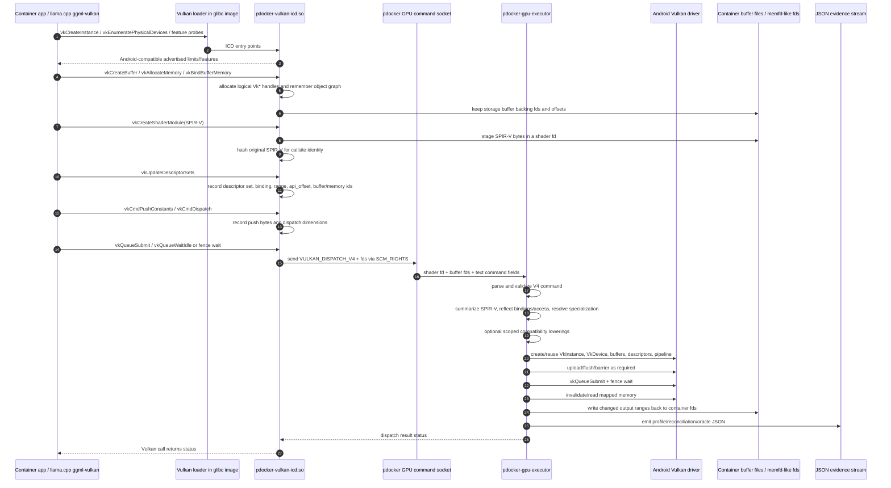
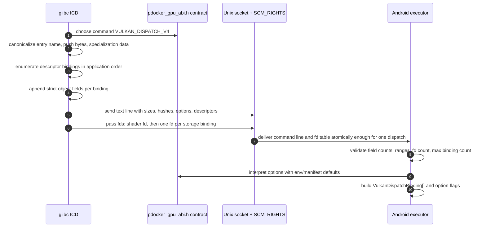
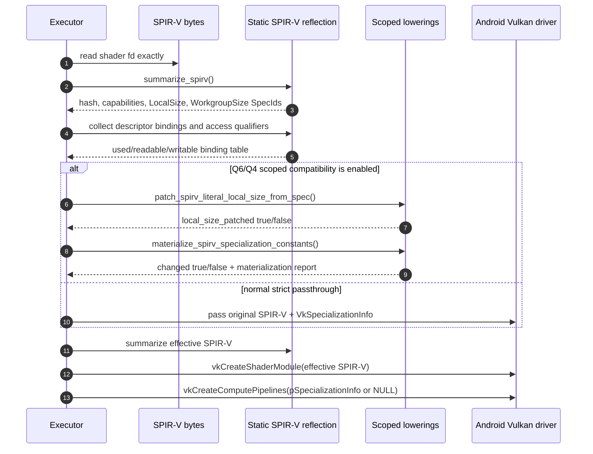
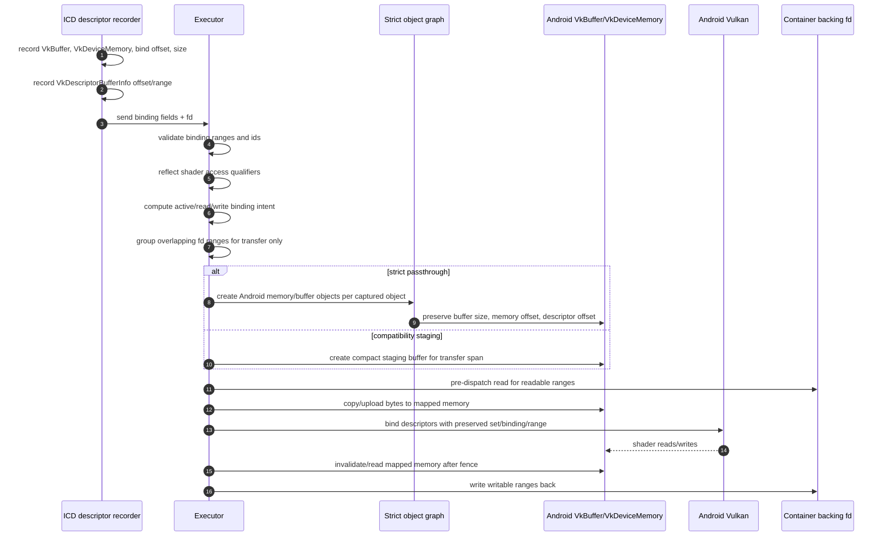
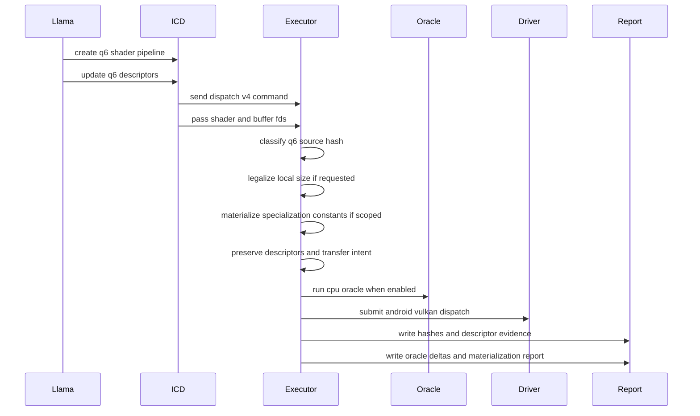
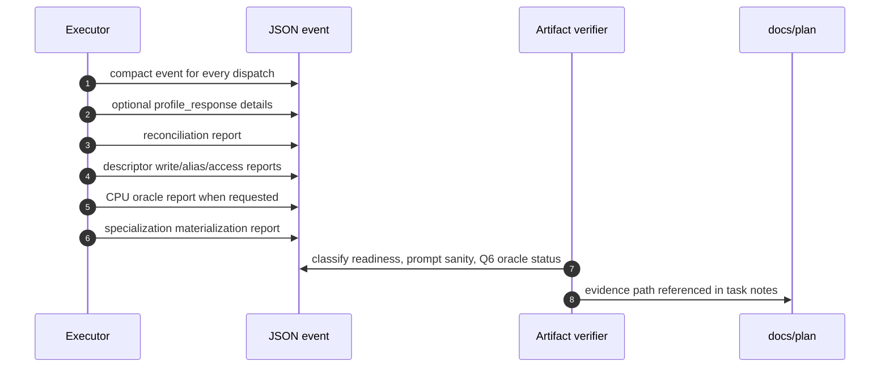

# Vulkan bridge call sequence and data flow

Snapshot date: 2026-05-24.

This document describes the implementation sequence for pdocker's Vulkan
bridge as it exists in the Android project.  It focuses on the real data path
used by unmodified container applications such as llama.cpp:

```text
glibc Vulkan application
  -> pdocker glibc Vulkan ICD
  -> pdocker GPU command ABI
  -> APK-owned Android/Bionic Vulkan executor
  -> Android Vulkan driver
  -> writeback and JSON evidence
```

The bridge is not raw vendor-library passthrough.  The container must not load
Android/Bionic GPU libraries directly.  Instead, the container-facing ICD
captures standard Vulkan calls, serializes the command state, and the APK-side
executor reconstructs Android Vulkan objects from that state.

## Source map

| Layer | Primary implementation | Responsibility |
|---|---|---|
| Container Vulkan ICD | `docker-proot-setup/gpu/pdocker_vulkan_icd.c` | glibc-facing Vulkan entry points, object/handle tracking, command serialization, fd passing |
| Shared GPU ABI | `docker-proot-setup/gpu/pdocker_gpu_abi.h`, `app/src/main/cpp/pdocker_gpu_abi.h` | command names, field names, feature flags, option propagation |
| Android executor | `app/src/main/cpp/pdocker_gpu_executor.c` | command parse, validation, optional compatibility lowerings, Android Vulkan execution, readback, diagnostics |
| Device package | `app/src/main/jniLibs/*/libpdockergpuexecutor.so` | packaged Android executable payload |
| Evidence tooling | `scripts/android-llama-gpu-compare.sh`, `scripts/android-llama-gpu-q6-workgroup-run.sh`, `tests/test_gpu_abi_contract.py` | repeatable runs, ABI/env/test guardrails |

## Top-level call sequence



## Command payload sequence

`VULKAN_DISPATCH_V4` is the main compute dispatch packet.  The text command and
the fd array are both part of the payload; either one alone is incomplete.



The command includes these field groups:

1. **Shader identity**: `shader_size`, entry point, source SPIR-V bytes, source
   hash.
2. **Dispatch identity**: `dispatch_x`, `dispatch_y`, `dispatch_z`.
3. **Push constants**: byte count and hex payload.  The executor must not
   reinterpret the push struct as a C struct unless a diagnostic oracle is
   explicitly analyzing a known callsite.
4. **Specialization constants**: `{constantID, offset, size}` map entries and
   the raw specialization data blob.
5. **Descriptor bindings**: descriptor set, binding, transfer offset/size,
   Vulkan-visible descriptor offset/range, buffer size, memory offset/size,
   memory id, and buffer id.
6. **Policy/options**: strict passthrough, device-local staging, descriptor
   access reflection, local-size legalization, specialization materialization,
   safe-kernel diagnostics, caches, dirty probes, feature disables, and oracle
   settings.

## Data flow and transformation map

The design rule is simple: preserve application-visible Vulkan semantics first;
only apply narrow, recorded compatibility lowerings when Android driver behavior
requires it.  Every transformation must be visible in JSON evidence.

| Data item | ICD capture | Executor use | Allowed processing | Evidence fields |
|---|---|---|---|---|
| SPIR-V module | copied byte-for-byte into shader fd | read from fd, summarized, optionally patched | hash, reflection, scoped LocalSize legalization, scoped specialization materialization, optional diagnostic safe-kernel replacement | `source_spirv_hash`, `effective_spirv_hash`, `oracle_spirv_hash`, `local_size_patched`, `specialization_materialized`, `q6k_safe_kernel` |
| Entry point | Vulkan string from app | pipeline shader stage `pName` | length validation and NUL termination only | `entry` |
| Specialization constants | raw `VkSpecializationInfo` map/data | either passed to driver or materialized into SPIR-V | validate ranges; scoped Q6/Q4 materialization only | `specializations`, `pipeline_key.spec_hash`, `specialization_materialize_report` |
| Push constants | raw bytes | `vkCmdPushConstants` | no product-path interpretation; diagnostic oracles may decode known callsites | `push`, `push_size`, oracle reports |
| Descriptor set/binding | `vkUpdateDescriptorSets` records | descriptor set layout and writes | preserve set/binding; optional duplicate descriptor materialization only when recorded | descriptor write report, alias report |
| Descriptor offset/range | `VkDescriptorBufferInfo.offset/range` | descriptor write offset/range | preserve descriptor coordinate system; do not confuse with memory-file offset | `api_offset`, `api_range`, `binding_gpu_offset`, `binding_descriptor_offset` |
| Buffer/memory identity | ICD logical ids and backing fd | strict object graph or staged buffers | preserve logical identity in strict mode; alias grouping only for transfer efficiency | `strict_object_graph`, `api_memory_id`, `api_buffer_id`, alias hazards |
| Input bytes | backing fd range | upload to mapped Android VkBuffer memory | read/upload when shader reflection says readable or strict transfer requires it | upload hashes, `read_bindings`, skipped upload bytes |
| Output bytes | backing fd range | read back after fence/invalidate | write back only shader-writable bindings; preserve alias evidence | writeback hashes, `write_bindings`, dirty/writeback reports |
| Barriers/fences | submit/wait sequence | Android command buffer barriers + fence wait | required host/device visibility synchronization | `pre_barriers`, `post_barriers`, dispatch timings |

## SPIR-V processing sequence



### SPIR-V processing rules

- Hashing and reflection are observation.  They do not change shader bytes.
- `patch_spirv_literal_local_size_from_spec()` is a narrow compatibility
  lowering for shaders that expose intended workgroup shape through
  specialization-backed `WorkgroupSize` while carrying a stale literal
  `LocalSize 1,1,1`.
- `materialize_spirv_specialization_constants()` converts scoped
  `OpSpecConstant*` values into ordinary `OpConstant*` values only when the
  expression tree is understood and the result does not grow the module.
- The materializer now reports why it did or did not rewrite:
  `failure_reason`, folded counts, first unsupported opcode/spec-op, output
  word count, and WorkgroupSize subtree preservation.
- Diagnostic safe kernels are not product passthrough.  They are controlled
  probes to split bridge/object-graph bugs from native shader behavior.

## Descriptor and memory sequence



The important distinction is between **descriptor coordinates** and **backing
memory coordinates**:

```text
descriptor-visible address = VkDescriptorBufferInfo.offset
backing-file address       = api_memory_offset + VkDescriptorBufferInfo.offset
```

Strict mode must preserve both.  Any optimization that stages a smaller byte
range must still make descriptor offsets and buffer bounds appear exactly as the
application requested.

## Current Q6_K diagnostic flow

The current llama GPU work is focused on Q6_K correctness.  The relevant
sequence is:



Known current state:

- The application-facing llama.cpp code, Dockerfile, model, and prompt remain
  unchanged.
- Q6 strict passthrough reaches Android Vulkan execution.
- Q6 writeback from GPU memory to the container range is verified, but output
  correctness is not yet proven.
- The newest evidence point being added is the specialization materialization
  decision report, because Q6 currently requests materialization but has not
  shown an effective rewrite.

## JSON evidence sequence



Evidence must be specific enough to answer:

1. Did the ICD send the same Vulkan fields llama.cpp requested?
2. Did the executor receive and validate those fields without loss?
3. Was any SPIR-V or descriptor transformation applied?
4. If yes, which exact scoped rule applied and what hashes changed?
5. Did Android Vulkan execute, synchronize, and write back the expected ranges?
6. Did deterministic prompt and/or Q6 oracle correctness pass?

## Non-goals and claim gates

- This bridge does not inject Android vendor Vulkan libraries into the glibc
  image.
- It does not modify llama.cpp, its Dockerfile, its model, or its prompt to
  obtain GPU correctness.
- Diagnostic safe kernels, CPU oracles, and shader materialization are not
  performance claims.
- A benchmark claim is allowed only when the verifier has a passing
  reconciliation artifact and prompt/oracle correctness for the same run.
